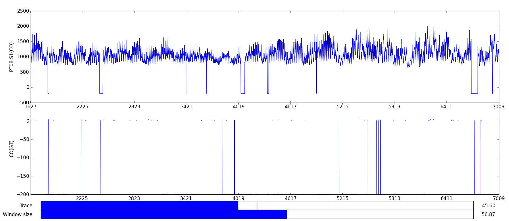
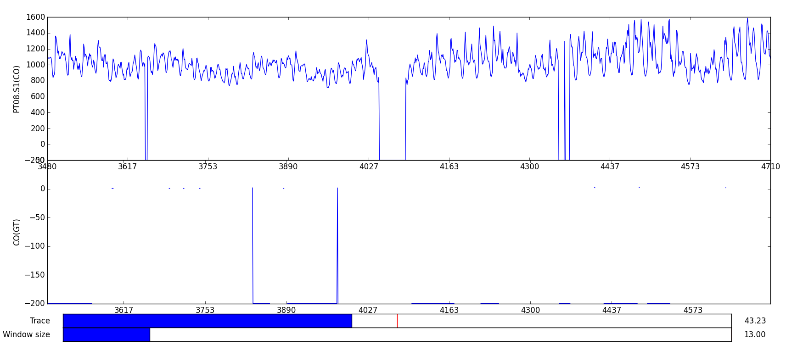
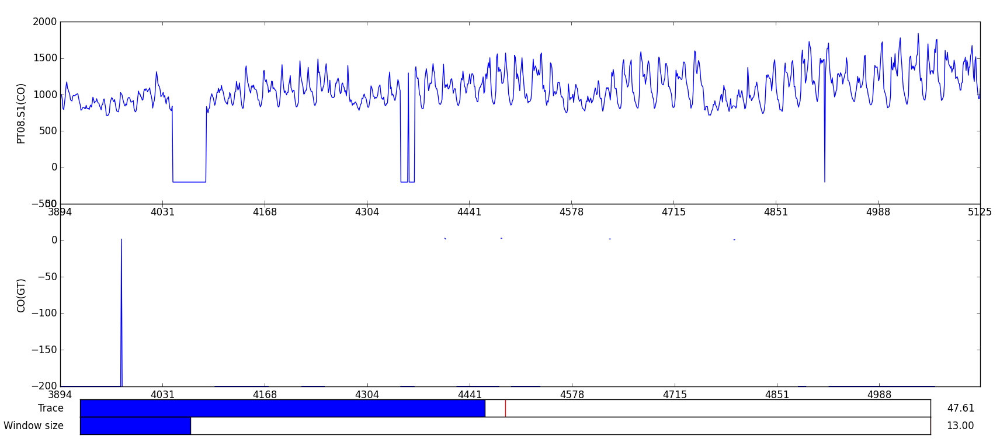

# QuickPlot

A small python (2/3) script to quickly investigate a csv file. 

It is quite handy while doing research and investigate benchmark results, traces, etc. 

I add features as I need them. Feature requests via maesker@gmx.net

# Sample usage

python quickplot.py -f samples/uci_airquality/AirQualityUCI.csv -c "CO(GT),PT08.S1(CO)"

Use the "Window size" slider to zoom into the plot:

Use the "Trace" slider to navigate within the plot:

